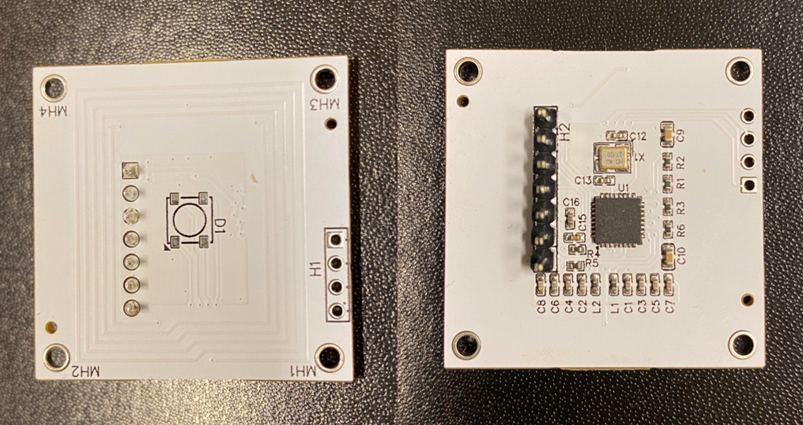
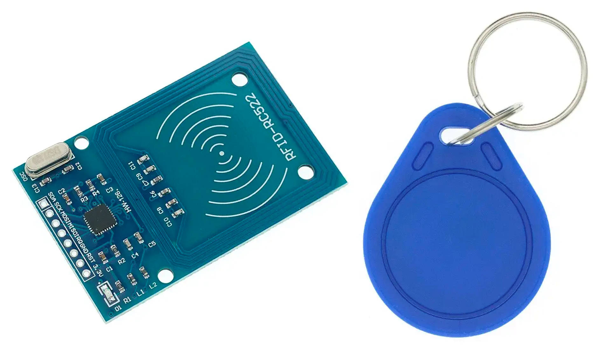
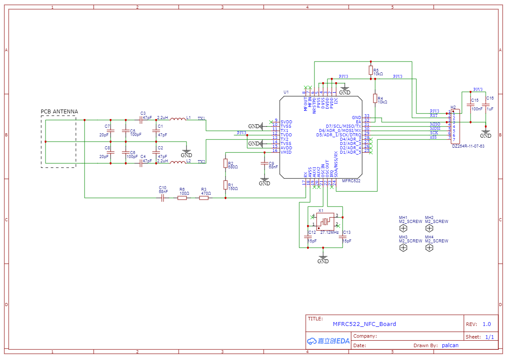
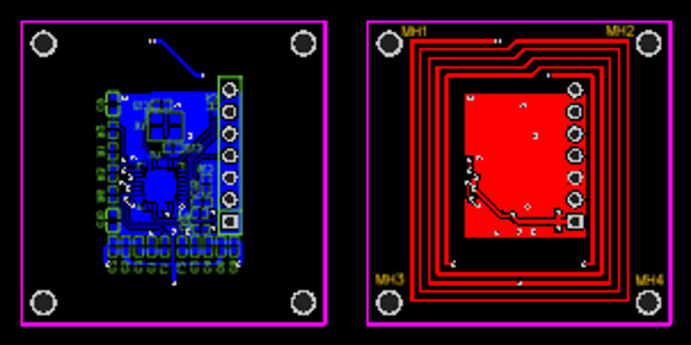
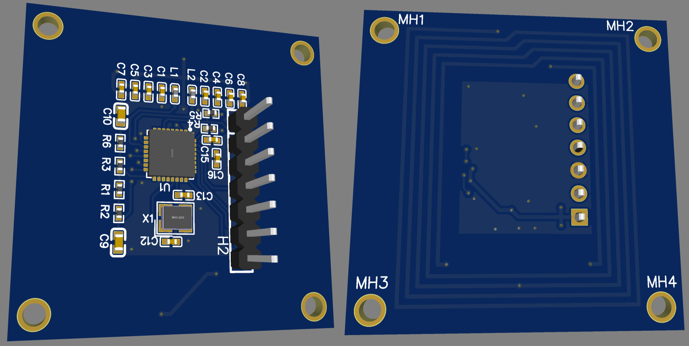
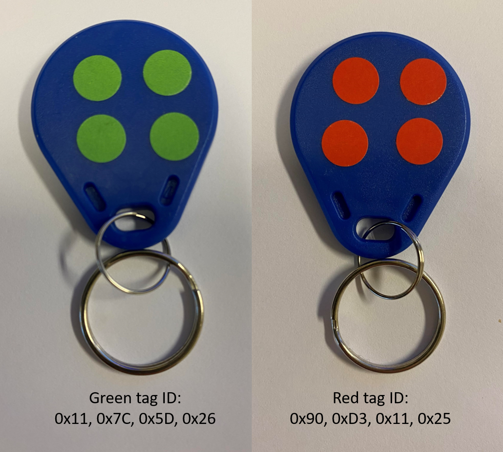
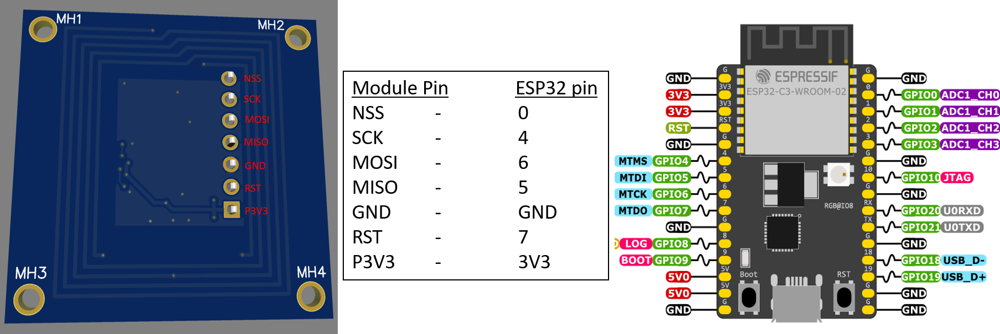
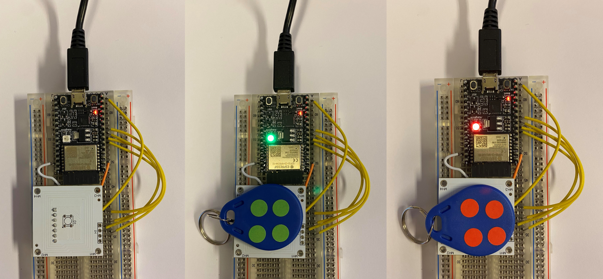

# MFRC522-Board Readme & Developers Blog



*My custom designed MFRC522 NFC reader*

Although it is fun to write a more blog-style entry, I believe a typical readme should a least contain the following info before jumping into the more prosaic elements:

- A general description of the project:
  - _A custom PCB with NFC frontend chip MFRC522 and Antenna, with SPI interface, used to read simple Mifare tags and indicate read status with a LED_

- The project status:
  - _The project is finished, and intended to be reused, in some form, in a new and slightly larger project for multiplexing 4x of the modules that can be found in a new repo some time in the future. The code in this repo will not be further updated._
     
- The requirements on the development environment for integration:
  - _I've used plain Aurdiono IDE (version 1.8.13) for the code. The code should work fine with any ESP32 board that has HW SPI and a builtin LED. The custom MFRC522 module I made can be interchanged with the commonlys sold RC522 and RC522 MINI modules_
  
- A guide to installation and use:
  - _The Arduino IDE downloads and use is extensively documented by Arduino.cc._
  - _The entries in the code where the red and green tag ID's are set must be changed to the IDs of your own tags that you will be using_
  - _The specs for the ESP32 devboard I've used here can be found at https://docs.espressif.com/projects/esp-idf/en/latest/esp32c3/hw-reference/esp32c3/user-guide-devkitc-02.html._
  - _As stated earlier, the NFC modules can be bought all over the internet, and the pinout is typically printed on the modules_
  - _The library in use can be found through normal library search in the Arduino IDE (if you don't know how, there's info on Arduino.cc that explains that much better than me). The l\ink to the library Github page is https://github.com/miguelbalboa/rfid/tree/master._

- A list of technology used and any links to further information related to this technology:
  - _Much of the technology used (what we can call technology in this context) is readily available in uncounted sources a quick google search away. Keywords are_
    - _SPI_
    - _ESP32_
    - _Arduino IDE_
    - _Neopixel_
  - _For a deeper understanding of NFC there's multiple primers out there that can be helpful, I used the educational material available from NXP and STMicro quite a bit, and read through a few of the examples on connecting ESP32 and Arduino to RC522 (Lots of videos on Youtube on this)_

- Known bugs and any bug fixes:
  - _The first version I made of the custom board had a header H1 and a WS2812B RGB LED on as well. I've later removed those. You'll se the unpopulated footprints of them on the modules used in this project, while they are not present in the schematic shown._
  - _It is a bit unfortunate to place a through hole header where I did, as it protrudes up on the surface where the tag should be placed. If there will be a later revision of the PCB, I might move it all the way to the board edge, or rearrange the component placement enough to find board space for a SMD header_
  - _If there will be a later revision of the PCB, I'd print the signal names on the silkscreen next to the header pins. It was a bit unnecessarily annoying to have to check my notepad all the time to see which pin was which signal_
    
- FAQ section with all previously asked questions:
  - _Nobody has asked anything yet...!_
 
- Copyright and licensing information:
  - _See the final chapter of this Readme file_

  
## Table of Contents
[Introduction](#Introduction)  
[Design](#Design)  
[Test](#Testing-the-custom-MFRC522-NFC-reader)  
[Code explanation](#Code-explanation)  
[Cost Discussion](#Cost-Discussion)
[License](#License)

## Introduction

I recently found my self interested in combining electronics with physical games. I was on paternity leave at that time, and so had some time to think and read and throw together quick breadboard protoypes, and even sometimes do a bit of schematic and layout design, while the baby was sleeping. The result of all the bits and pieces that came out of it is now organized into this repository and presented here in this document. 

After reading up on several possible approaches, it seemed like NFC would be a great technology for combining electronics with physical games, so down the rabbithole I set off. After using google for quite a bit, I found som very cheap cheap NFC boards and cheap tags, built around the MFRC522 chip and the Mifare Classic tags. The size of the tags (25 mm diameter) seemed perfect for making an electronic game with multiple sensor tiles and some decently sized game figurines. I therefore went and bought 10 of the most common NFC board found all over the internet, the RC522 RFID RECEIVER,  

  

*RC522 RFID Receiver module and compatible tag - MIFARE Classic 1k - that accompanied each purchased RC522 module*  

  
and tried it with an Arduino Uno the way it was shown in various guides and Youtube videos. The first board worked fine with the  RC522 library written by Miguel Balboa (https://github.com/miguelbalboa/rfid/tree/master).  

The second board I tried did not work however (and also died). A quick glance at the datacheet for the frontend chip on the board, the MFRC522, revealed that this is a chip that works with 3.3V, not 5V! Replacing the Arduino Uno with an ESP32 dev board solved it, as the remaining RC522 boards worked. (Note to self - should have read what it said on the silkscreen on the RC522 Module, it is clearly stated 3.3V there!)

Next step was to use the SPI interface to control multiple of these modules from the ESP32. Not surprisingly it worked with two modules, and then surpringsly it failed with three and four modules. And even more surprisingly it didn't work again with two modules (different modules than the modules that first worked). After trial and error it seemed that three out of the remaining 9 boards could be used on the same SPI bus, but adding any of the other 6 modules caused everything to stop working. After reading a large number of forums and forum posts, it seemed like some variants of the MFRC522 chip has a poorly implemented SPI interface. Namely, the MISO line does not change to high impedance when the SS line is inactive! Meaning the MISO line is actively driven at all times by the modules that aren't supposed to drive it. 

(The MFRC522 datasheet does not mention anything about the state of the SPI output pins when the chip is not selected, and does not contain any timing diagrams for multiple SPI bus usage. So it might be that the libraries used for some projects set up behaviour that does not work with this chip - e.g. not waiting long enough before/after a change on the SS signal before starting commmunication, as it is not specified how long after SS goes low that the MISO goes tri-state. )

A few workarounds could solve this (using a separate tristate buffer for all MISO lines with the respective SS signals used for enable for the individual MISO lines; or holding the SS line active at all time for all modules, and having all the MISO lines as multiplexed individual inputs to the microcontroller instead), but the mystery was why some MFRC522 chips SPI interface worked and some didn't. 

Given the low pricepoint the modules is available at from some of the sellers, and the fact that specialized IC's such as these NFC frontends usually has relatively high costs, I started suspecting cheaper counterfeit or at least non-NXP chips being used. A quick look on Digikey.com at the components used in the module shows that the most expensive component is indeed the MFRC522 chip (sells for 5 Euro). A check at LCSC.com shows that they sell in bulk for "1500+ @ US$2.0857 exc. VAT" from NXP, but also that they sell a JSMSEMI variant of the chip for "1500+ @ US$0.7319 exc. VAT". I believe the JSMSEMI chips (or other variants that aren't the true NXP chips) are used to drive down the price, but these chips has a SPI interface that isn't correctly implemented. There's probably a mix of RC522 modules out there where some has the NXP chip, and some has the cheaper chip with faulty SPI interface. If a module sells for lower cost than the supposed price of just one of the chips on it, it's time to be suspicious.   

The RC522 modules are also quite large at 60mm x 40mm (there's a smaller variant, RC522 MINI, that I later found that looks better). I am not sure which form factor I need for later use, but I do know that I want the SPI bus to work properly, and at this point I was deep enough into the details that I understood the design fairly well.

**Conclusion:** To ensure I have modules that work properly I should design them myself to ensure having the correct NXP chip, and test which libraries that confrom to the chip's SPI requirements. This provides the added benefit of having the option to customize the form factor and component placement to fit any later design variations I might want. It will also ensure that I can use the SPI bus to it's full functionality with multiple devices on a single bus. 

[Back to Table of Contents](#Table-of-Contents)  

## Design

The design was done with the EASY EDA software, as the integration with LCSC parts library and JLPCB's PCB and Assembly service, combined with the pricing offered, was the best I could find.  Below follows the schematic and a design description  



*Custom MFRC522 NFC reader SCHEMATIC*


- C15 and C16 next to the connector H2 is basicly decoupling capacitors. They are there to provide a small amount of stopgap energy for the P3V3 pins for the most high-frequency current demands, as the P3V3 supply is often "far" away, and connected through thin wires, and therefore has a realtively low bandwith due to the assosiacted inductance.<br/>

- pin 6 of U1 is pulled up to P3V3 in case of RST line not being connected by the user to the microcontroller, and to provide a defined startup while the microcontroller pin is in a undefined state
- pin 32, EA, and pin 1, I2C, sets the communication interface. Pulling I2C low and EA high selects SPI as the active interface. Other pull-up/low combinations of these pins allow for selecting I2C or UART as communication interfaces.
- X1 is the external 27.12 MHz crystal required by the MFRC522 datasheet, and the 15pF capacitors are the loading capacitance calculated for this crystal (A crystal’s frequency is specified for load capacitance CL. If the actual capacitance is too high, the crystal will oscillate more slowly. If the capacitance is too low, it will oscillate faster. After testing is seems that 15pF seems to work well enough for this design)
- L1 and C1 (and correspondingly L2 and C2) is the EMC filter, while also affecting the impedance matching. This basically low-pass filters away the TX1 antenna drive output energies of U1 that is above 15.5 MHz. The compontent values are chosen to achieve this cut-off frequency, while also allowing for choosing reasonable impedance matching values for the following C3/C5+C7 matching network
- As stated in the above bullet, C3/C5+C7 is the impedance matching network. The better match, then more of the power being driven out from TX1 is translated to radiation from the antenna. If the matching is bad, more power is lost to heat insted of being transmitted by the antenna. Transmitted power nonlinearly decreases with distance in the near-field region (which NFC is), and it decreases with between 4x to 16x for every 2x distance increase. The 4x to 16x figure is variable due to lots of factors (antenna geometry, reciver geometry, surrounding materials, etc). Still, having to at minimum quadruple the power consupmtion of your module to double the read distance quickly limits the maximum read distance achievable before the MFRC522 chip overheats. So better to design a matching network that effectively transfer most of the available power into radiation for the antenna. 
- The purpose of the C10 capacitor is to provide an AC coupling of the RX signal. A value of 1nF - 100nF can generally be used, here 68nF is chosen purely based on re-use from the existing design of one of the RC522 modules out there. The purpose of the resistors in the Rx and VMID path is to provide a voltage drop so that the RX input is not saturated. The first step of the RX path tuning process is to define which RX path connection is the best. For small antenna or antenna setup in a stringent environment (e.g. metal surrounding, bad isolating ferrite, etc) a direct connection to antenna is preferred. For large antenna or optimized setup (e.g. antenna in back cover) the connection can be preferably done on the EMC filter. At this design, the connection point should therefore be directly to the antenna. Once the RX connection point has been chosen according to the setup, RX path resistor values must be carefully adjusted. The resistor values on the RX path must be chosen to guarantee that the peak voltage at RXn and RXp stays below 1.65Vpk. This may require acutally measuring the designed circuit to see if the values chosen is giving the correct results. The values chosen for this design was taken from the existing design of the same RC522 module as used for the C10 capacitor, and seem to be working without issue.

The stackup chosen is a two layer board, as the design itself is relatively small with few components and without many signals that has to cross each other. The antenna is designed in a rectangle to provide enough space for the components in the middle of the board while allowing for some extra space for the mounting holes in each corner. The width of the antenna tracks and number of turns and spacing between turns is the main factors to use for tuning the impedance of the antenna. 



*Custom MFRC522 NFC reader PCB layout*




*3D render of the custom MFRC522 NFC reader Assembled*

[Back to Table of Contents](#Table-of-Contents)  

## Testing the custom MFRC522 NFC reader

To verify that the reader not only detected tags, but also enabled some basic functionality that I've seen missing in many of the guides on using the RC522, I decided to implement a short and quick proof-of-concept for tag identification functionality based on the tags individual ID. Since these IDs are unique to each tag, they are ideal for any type of project that deal with granting/denying access. I got two tags and colored them red and green and read out their ID (can do this with an app on your phone, or by using the code in this project to see what the serial monitor prints out). I wrote the code such that the onboard LED on the ESP32 dev board would light up green for 1 second when reading the green tag, and red for 1 second when reading the red tag. 



*The tags with their associated ID's*

A simple breadboard and some wires was used to wire up the module to the ESP32 dev board - the wiring diagram below shows how, and the image below that shows how the actual breadboard ended up looking. 



*Wiring list of ESP32 dev board and the MFRC522 module*

The image and gif below shows that the module reads the tags and differentiates between the red and green just as intended



*Recognizing the tags*


*Recognizing the tags -gif-*


[Back to Table of Contents](#Table-of-Contents)  

## Code explanation

Please see the reposirory folder "Code" for the the full code where the snippets and blocks below are copied out from.

The first block is basically just including the necessary external libraries used in the program. Note that no neopixel library is necessary to include, even though neopixel functions is called in the later code. This is due to the specific ESP32 dev board used in this project that already has that available. The SPI library lets you use the built in SPI bus for this ESP32 dev board, and the MFRC522.h library gives the abstraction layer functions you use to talk to the MFRC chip on the NFC module. 

```
#include <SPI.h>
#include <MFRC522.h>
```

The reset pin for the MFRC522 chip is not part of the SPI bus, but is necessay to define before initializing the MFRC522 instance, so must be set at this section. The same goes for the SS pin (although it _is_ part of the SPI bus). It is defined separately from the SPI bus to allow for defining multiple SS pins when you have more than one device on the SPI bus  

```
#define RST_PIN         7           // Configurable, not part of ESP32 SPI hardware pins
#define SS_PIN          0           // Configurable, not part of ESP32 SPI hardware pins
```

The MFRC522 chip is instantiated here, with the reset and SS pins as arguments, which tells the function to instantiate it with SPI interface (a different set of arguments would have told the function to use the I2C or UART interface instead). The instance consists of multiple datafields that are updated whenever the chip is read. Since it is created here at the global workspace, it will be accessible anywhere in this program. 

```
MFRC522 mfrc522(SS_PIN, RST_PIN);              // Create MFRC522 instance
```

We're also pre-defining the ID's of the tags we want to read as global values, so that they can be used whenever and wherever we need them. As the ID's consist of 4x bytes, we need to define a byte array to hold them.

```
byte red_tag[4] = {0x90, 0xD3, 0x11, 0x25};    // Creating the byte array holding the red RFID tags Unique ID
byte green_tag[4] = {0x11, 0x7C, 0x5D, 0x26};  // Creating the byte array holding the red RFID tags Unique ID
```

Although quite a bit is happening in the setup section, most of it is fairly straightforward, and we will tackle it in three chunks. The Serial.begin line starts serial communication with the ESP32 at a predefined datarate of 9600 baud. The need for setting a specific datarate is because UART does not provide it's own separate clock signal, meaning both ends of the communication need to agree on the clock rate beforhand. The while(!serial) sets the program to wait at this point until a serial terminal is opened. (So, beware, if you don't open the serial terminal, you won't be able to start reading the tags and seeing the LEDs respond. If you want this program to run from a battery or other power supply, and not be connected to a PC, you should remove the Serial parts of the program, as you will never be able to open a terminal and never proceed with the program). SPI.begin just starts up the SPI bus so that we can begin sending/receiving data over it.  

```
void setup() {
  Serial.begin(9600);                 // Initialize serial communications with the PC
  while (!Serial);                    // Do nothing if no serial port is opened (usually added for Arduinos based on ATMEGA32U4)
  SPI.begin();                        // Initialize the SPI bus
```

As we discussed in the sections above, the mfrc522 instance is globally available, so we can call it here, and it has a set of functions and datafields that comes with it. Here we call the initializer function that starts up this specific instance of the mfrc522. It's important to have begun the SPI bus before we initialize the mfrc522 instance. The delay that follows is to give the chip enough time to run all it's internal start up and set up and configuration routines before we start asking it to do stuff (before this, the only thing we could tell it was to start up, or initialize). We proceed with a call to the mfrc522 to tell us which firmware version it has loaded onto it. If the output we receive isn't garbage, we know we have started up our RC522 module correctly. We finish by letting the user know that we now are ready have a tag scanned. The PCD and PICC names are the industry names for reader and tag. PCD = Proximity Coupling Device. PICC = Proximity Inductive Coupling Card. Note that the terms PICC and PCD most often are used for NFC systems that reads tags based on the ISO14443 standard, and other names might be used in other circumstances. 

```
  mfrc522.PCD_Init();                 // Init MFRC522
  delay(4);                           // Optional delay. Some board do need more time after init to be ready
  mfrc522.PCD_DumpVersionToSerial();  // Show details of PCD - MFRC522 Card Reader details
  Serial.println(F("Scan PICC to see UID, SAK, type, and data blocks..."));
```

Finally we tell the ESP32 to turn off the Red, Green and Blue LEDs in its neopixel. The neopixel functions are native to this ESP32 variant, so beware of possible issues if you try to reuse this code with other ESP32 chip types. The RGB_BUILTIN is defined for this specific dev board, so again beware of possible issues if you try to reuse this code with other ESP32 chip types.  

```
  neopixelWrite(RGB_BUILTIN,0,0,0);   // Set the built in ESP32 Dev board LED to Off / Black
}
```

The main superloop starts by checking a couple of things. First it just resets the loop if there is no tags present on the reader. Second, if there was a tag present, it tries to read in the data from the tag. If the data couldn't be read, it just resets loop. If data could be read, it continues down to printing the Unique ID of the tag to the serial monitor. It uses a helper function to print the UID, dump_byte_array, this function is explained in the last part of this section. The next two blocks are identical, except for referencing red and green respectively, and the neopixel stuff was explained in the setup section block already. That leaves the if statement and memcmp function. The memcmp function is a standard C language function which reinterprets the objects pointed to by the first and second argument as arrays of unsigned char, and compares the first specified bytes (in the code below, we have 4 bytes) of these arrays. The function returns an integer, 0, if all bytes are equal. 

```
void loop() {
  
  if ( ! mfrc522.PICC_IsNewCardPresent()) {                     // Reset the loop if no new card present on the MFRC522 reader... 
    return;                                                     // ...This saves the entire process when idle.
  }

  if ( ! mfrc522.PICC_ReadCardSerial()) {                       // Read the tag that is present on the MFRC522 reader ...
    return;                                                     // ...(this updates the datafields of the global "mfrc522" instance from the GLOBALS section)
  }

  Serial.print(F(": Card UID:"));                             // Show some details of the tag that was found
  dump_byte_array(mfrc522.uid.uidByte, mfrc522.uid.size);
  Serial.println();

  if (memcmp(mfrc522.uid.uidByte, red_tag, 4) == 0){            // Compare the byte array for the red tag with the ID read from the tag present on the MFRC522 reader
    neopixelWrite(RGB_BUILTIN,RGB_BRIGHTNESS,0,0);              // Set the built in ESP32 Dev board LED to RED
    delay(1000);
    neopixelWrite(RGB_BUILTIN,0,0,0); // Off / black            // Set the built in ESP32 Dev board LED to Off / Black
    delay(1000);
  }

  if (memcmp(mfrc522.uid.uidByte, green_tag, 4) == 0){          // Compare the byte array for the red tag with the ID read from the tag present on the MFRC522 reader
    neopixelWrite(RGB_BUILTIN,0,RGB_BRIGHTNESS,0);              // Set the built in ESP32 Dev board LED to RED
    delay(1000);
    neopixelWrite(RGB_BUILTIN,0,0,0);                           // Set the built in ESP32 Dev board LED to Off / Black
    delay(1000);
  }
}
```

That's almost it, only the helper function is left. What this basically does up in the main loop is taking the MFRC522 UID buffer as the first argument, as it contains the byte values of the UID. And then it takes the length of the UID buffer as the second argument (which is in this case 4, as the ID's for the tags are 4 bytes long). Then it steps through each byte and prints out each byte as text on the serial monitor. 

```
void dump_byte_array(byte * buffer, byte bufferSize) {          // Helper function which steps through each of the bytes in the tags ID and prints them to the terminal
  for (byte i = 0; i < bufferSize; i++) {
    Serial.print(buffer[i] < 0x10 ? " 0" : " ");
    Serial.print(buffer[i], HEX);
  }
}
```

And that's all of it!

[Back to Table of Contents](#Table-of-Contents)  

## Cost Discussion

One of the issues I had with the RC522 modules is that so many of the ones I found sold in various online stores either were prohibitively expensive for mass use (> $5), or suspiciously cheap (< $1). After designing my own, I could analyse the costs a bit more thoroughly and get a feel for which pricing would be reasonable to expect for a RC522 module. Below is a summary of JLPCB's pricing for production of 50x assembled PCBs, and the breakdown into whats fixed costs (independent of bying 5x, 50x or 500x), and what's the unit costs that gets added for each unit produced.   


*Pricing from JLPCB for producing and assembling my Custom MFRC522 PCB*

What becomes clear, and was expected due to the MFRC522 chip's cost of about $2, is that there's a minimum cost of $2.638 for each of the PCB's. This cost changes very little with larger volumes. So how come there's RC522 modules available on AliExpress for less than a dollar? A few ideas that I can think of on how to further reduce costs:
- Remove the pin header from the assembly and deliver separately for the customer to solder on. They cost about $0.03, but add £3.50 to the NRE part due to hand soldering
- Larger volumes, usually drives down cost by 20%-30%
- Use the JSMSEMI variant of the chip that sells for about $0.8 in quantities of 50+ and about $0.7 in quantities above 1500

Doing the match with these changes you'd first end up with fixed cost reduction to $27.23, and component cost of $48.31 (total scaling cost of 62.78). Reducing the components cost with 30% by assuming a very large volume let us assume we can go from component cost of $48.31 to $33.81 (meaning total scaling cost of $48.3, giving unit cost of $0.97). 
- Total cost for a RC522 module in large volumes, here using an order of 5000 as example, ends up being
  - $0.97 in scaling cost
  - ($27.23 / 5000) = $0.0055, or as good as negligble NRE costs
  - Shipping cost and packing, divided by 5000, is assumed to be almost negligble for such a simple small module

**Conclusion:** It would be reasonable to expect a pricing of minimum $1 for a RC522 module, anything that sells for significantly less has very little profits left for the seller.

Disclaimer: This is just my own thoughts and I do not cast any suspicion onto any specific seller. I do not know if a seller has done some very clever engineering and significantly brought down costs in a way I haven't thought of, and I cannot rule it out. I only work from what publically available information I was able to find for my own use, and I am aware that it is limited. 

[Back to Table of Contents](#Table-of-Contents)  

## License

Copyright 2023 palcan

Permission is hereby granted, free of charge, to any person obtaining a copy of this software and associated documentation files (the “Software”), to deal in the Software without restriction, including without limitation the rights to use, copy, modify, merge, publish, distribute, sublicense, and/or sell copies of the Software, and to permit persons to whom the Software is furnished to do so, subject to the following conditions:

The above copyright notice and this permission notice shall be included in all copies or substantial portions of the Software.
